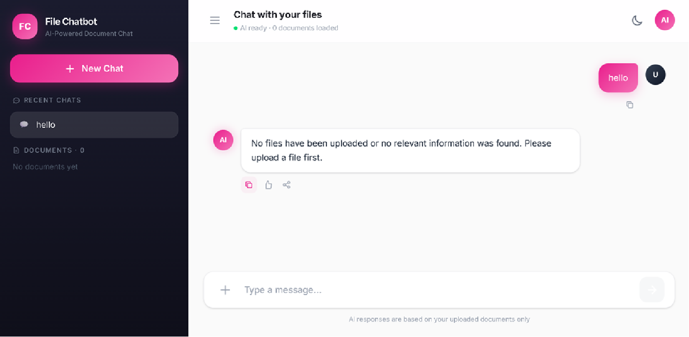
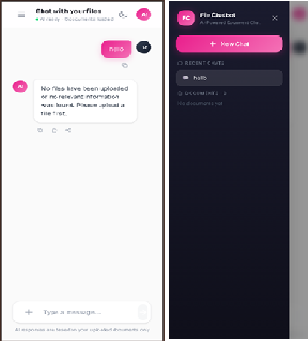

<div align="center">
  <h1>🚀 RAG File Chatbot</h1>
  <p>An intelligent document assistant powered by Retrieval-Augmented Generation (RAG). Upload your PDFs, Word documents, and Images, and chat with them in real-time!</p>
</div>

---

## 🌟 Key Features

* **Multi-Format Support:** Upload `.pdf`, `.docx`, `.txt`, and images (`.jpg`, `.png`).
* **Intelligent Chat (RAG):** AI answers your questions *strictly* based on the uploaded context.
* **Privacy & Device Isolation:** Every user gets a unique, anonymous "Device ID". You only see and chat with files you uploaded from your own device.
* **Smart OCR:** Automatically extracts text from images and scanned PDFs using Tesseract OCR.
* **Fast & Free AI:** Powered by **Google Gemini 3.5 Flash** for blazing-fast inference.
* **Responsive UI:** Beautiful, dark-mode enabled modern interface that works perfectly on Mobile and Desktop.

---

## 📸 Screenshots

<div align="center">
  
  <br>
  <em>Desktop View: Uploading and Chatting with Documents</em>
</div>

<br>

<div align="center">
  
  <br>
  <em>Responsive Mobile View with Swipe Sidebar</em>
</div>

---

## 🛠️ Tech Stack

### Frontend
* **Framework:** Next.js (React)
* **Styling:** Tailwind CSS
* **Hosting:** Vercel

### Backend
* **Framework:** FastAPI (Python)
* **Vector Database:** ChromaDB (for fast semantic search)
* **Primary Database:** MongoDB & GridFS (for file metadata and raw file storage)
* **AI Provider:** Google Gemini API
* **Hosting:** Render.com

---

## 🏗️ Architecture

1. **Upload:** User uploads a document via the Next.js frontend.
2. **Process:** FastAPI receives the file, stores it in MongoDB GridFS, and runs a background task.
3. **Extract & Chunk:** The background task extracts text (using `pdfplumber`, `docx`, or `pytesseract`) and splits it into manageable chunks.
4. **Embed:** Chunks are converted into vector embeddings and stored in ChromaDB (tagged with the user's `Device ID`).
5. **Chat:** When a user asks a question, ChromaDB finds the most relevant chunks. These chunks are sent to the Gemini AI along with the question to generate a highly accurate, context-aware answer.

---

## 🚀 Live Demo & Deployment

The project is already live! You don't need to install anything to use it.

* **Frontend (Vercel):** [Replace with your Vercel URL]
* **Backend API (Render):** `https://file-chatbot.onrender.com`

---

## 💻 Local Development (For Developers)

If you want to run or modify this project on your own computer, follow these steps:
* Python 3.10+
* Node.js 18+
* MongoDB (Local or Atlas)
* A free Gemini API Key (from Google AI Studio)

### 1. Backend Setup

```bash
cd backend
python -m venv venv
source venv/bin/activate  # On Windows: venv\Scripts\activate
pip install -r requirements.txt
```

**Environment Variables (`backend/.env`):**
```env
MONGO_URI=mongodb://localhost:27017/
GEMINI_API_KEY=your_google_gemini_api_key_here
```

**Run the Server:**
```bash
uvicorn main:app --reload
```
*Backend will run on `http://localhost:8000`*

### 2. Frontend Setup

```bash
cd frontend
npm install
```

**Run the Client:**
```bash
npm run dev
```
*Frontend will run on `http://localhost:3000`*

---

## 🔌 API Endpoints

| Method | Endpoint | Description |
| :--- | :--- | :--- |
| `POST` | `/upload` | Upload a file and start background processing |
| `GET` | `/files` | List all files uploaded by the current device |
| `GET` | `/files/{id}/status`| Check processing progress of a file |
| `DELETE`| `/files/{id}` | Delete a file from GridFS and ChromaDB |
| `POST` | `/chats` | Create a new chat session |
| `GET` | `/chats` | Get all chat sessions for the current device |
| `POST` | `/chat` | Send a message to the AI and get a response |
| `GET` | `/clear-all-data` | **Admin:** Wipes the entire database to start fresh |

---

## 🔒 Security & Privacy
This project does NOT require user authentication (login/passwords). Instead, it uses **Anonymous Device IDs** generated via `crypto.randomUUID()` and stored in the browser's `localStorage`. This ensures zero-friction onboarding while keeping user data strictly isolated from others.
